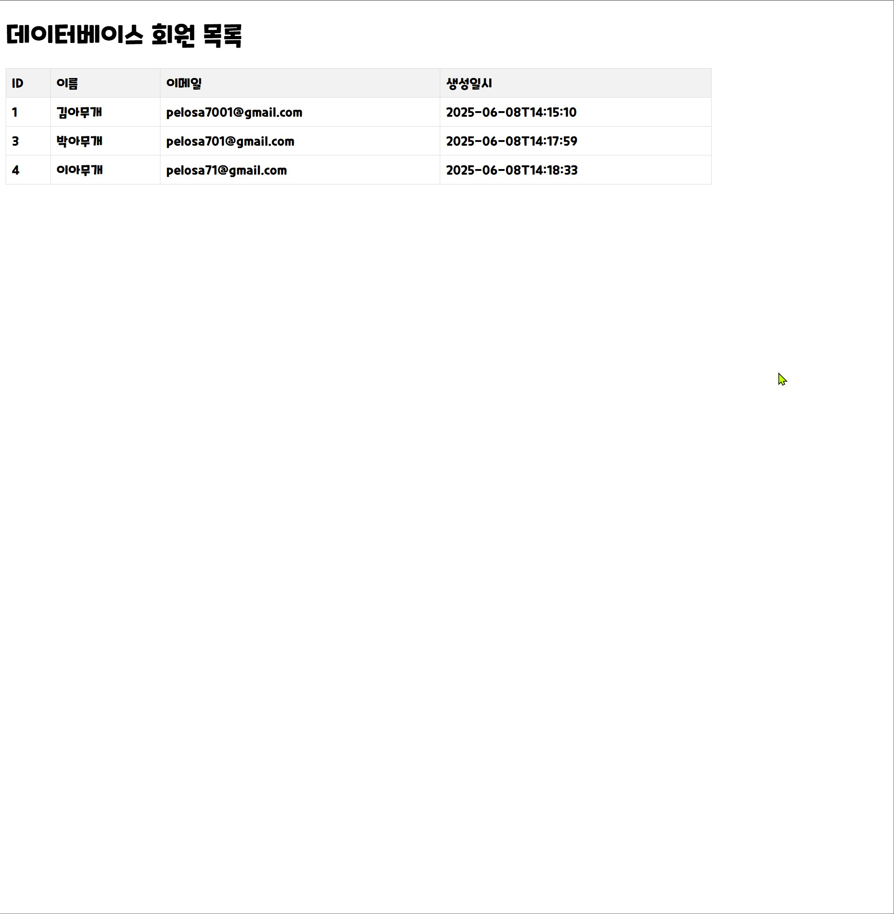

# 프로젝트 이름 (예: 나의 멋진 Spring Boot 앱) 🚀



당신의 프로젝트에 대한 간결한 한 문장 설명입니다.
(예: Jasypt를 이용한 Spring Boot 데이터베이스 비밀번호 암호화 데모 애플리케이션)

## 🌟 개요 (Overview)

이 프로젝트는 [프로젝트의 목적, 주요 기능, 해결하려는 문제 등에 대해 자세히 설명].
예를 들어, "이 Spring Boot 애플리케이션은 Jasypt 라이브러리를 사용하여 민감한 데이터베이스 연결 정보를 안전하게 암호화하고 관리하는 방법을 시연합니다. 웹 인터페이스를 통해 데이터베이스 'member' 테이블의 데이터를 조회하고 수정할 수 있습니다."

## 🚀 기능 (Features)

* **Jasypt 통합**: Spring Boot 애플리케이션에서 Jasypt를 활용한 프로퍼티 암호화/복호화 기능.
* **데이터베이스 연동**: MariaDB (또는 사용 중인 DB)와 JPA를 통한 데이터베이스 연결 및 관리.
* **웹 UI**: Thymeleaf 템플릿을 이용한 간단한 웹 인터페이스를 통해 DB 데이터 조회 및 수정.
* **엔티티 관리**: `member` 엔티티를 통한 데이터 모델링.

## 🛠️ 기술 스택 (Tech Stack)

* **백엔드**: Java 17+ (또는 사용 중인 Java 버전), Spring Boot 3.x
* **데이터베이스**: MariaDB (또는 사용 중인 DB)
* **암호화**: Jasypt (jasypt-spring-boot-starter)
* **ORM**: Spring Data JPA, Hibernate
* **웹 프레임워크**: Spring MVC
* **템플릿 엔진**: Thymeleaf
* **빌드 도구**: Maven
* **IDE**: IntelliJ IDEA

## ⚙️ 시작하기 (Getting Started)

프로젝트를 로컬 환경에서 실행하기 위한 단계별 지침입니다.

### 📋 전제 조건 (Prerequisites)

* Java Development Kit (JDK) 17+
* Apache Maven 3.6+
* MariaDB (또는 사용 중인 데이터베이스) 설치 및 실행
* IntelliJ IDEA (또는 다른 IDE)

### ⬇️ 프로젝트 클론 (Cloning the Repository)

```bash
git clone [https://github.com/당신의_깃허브_아이디/당신의_저장소_이름.git](https://github.com/당신의_깃허브_아이디/당신의_저장소_이름.git)
cd 당신의_저장소_이름